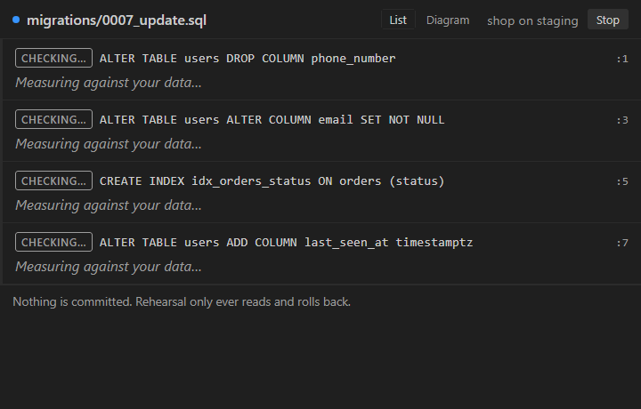

# Publishing Rehearsal

Everything here is free. No card, no subscription, no paid tier — the two
accounts below cost nothing and have no trial that expires. The only thing that
is not free is your time.

Written as the steps in order, with what to expect at each one, because the
Azure DevOps part is genuinely confusing the first time and the error it gives
when the token scope is wrong tells you almost nothing.

---

## 1. The publisher account (once, ~10 minutes)

The VS Code Marketplace runs on Azure DevOps, which is why this is more
involved than it should be.

**a. A Microsoft account.** Any one you already have works — outlook.com,
hotmail, a work one. Free.

**b. An Azure DevOps organisation.** Go to <https://dev.azure.com> and sign in
with that account. It will offer to create an organisation; accept. The name
does not matter and nobody sees it. The free tier is permanent and has no
card on file.

**c. A Personal Access Token.** In Azure DevOps, click your avatar (top right)
→ **Personal access tokens** → **New Token**. The three fields that matter:

| Field | What to set | Why |
|---|---|---|
| Organization | **All accessible organizations** | The default is your single org, and a token scoped that way is rejected by the Marketplace with a 401 that does not say this. |
| Expiration | Up to 1 year | You will need a new one after this. Put a reminder somewhere. |
| Scopes | **Custom defined** → scroll to **Marketplace** → tick **Manage** | The default "Full access" also works but is far more power than this needs. |

Copy the token when it is shown. It is shown exactly once.

**d. The publisher.** Go to <https://marketplace.visualstudio.com/manage>,
sign in with the same account, and create a publisher. The **ID** must be
exactly `azizguenni` — that is what `package.json` already says. The display
name can be anything.

---

## 2. Publish (2 minutes)

```bash
npm install
npm test          # 1,204 tests. Don't publish red.
npm run vsix      # builds rehearsal-0.0.1.vsix

npx vsce login azizguenni     # paste the token from 1c
npx vsce publish
```

It appears on the Marketplace within a few minutes. Search for "Rehearsal".

To ship a later version, bump `version` in `package.json` and run
`npx vsce publish` again — or `npx vsce publish patch` to bump and publish in
one step.

### If it fails

| Message | What it means |
|---|---|
| `401 Unauthorized` | The token's Organization was not "All accessible organizations", or it has expired. Make a new one. |
| `Publisher 'azizguenni' not found` | Step 1d was not done, or the ID differs. |
| `Missing publisher name` | You ran `publish` from the wrong directory. |
| `ERROR The Marketplace expects extension names...` | Someone already has the name. Change `displayName` (not `name`) and republish. |

---

## 3. Open VSX (optional, also free)

This is the registry VSCodium, Gitpod, Cursor and Eclipse Theia use. Publishing
here roughly doubles the reachable audience and costs one more account.

1. Sign in at <https://open-vsx.org> with GitHub.
2. Settings → **Access Tokens** → generate one.
3. Sign the publisher agreement it prompts you for (free, one click).
4. `npx ovsx publish rehearsal-0.0.1.vsix -p <token>`

---

## 4. The demo recording

The README has a placeholder comment where the GIF goes. This is the single
highest-value thing left, and it is the one thing nobody can do for you —
it needs a real editor, a real database and your screen.

What to record, in under ten seconds:

1. `testbed/postgres-shop` open, `npm run testbed:db` already running.
2. Open `migrations/0007_update.sql`.
3. Press `ctrl + alt + d`.
4. Let the four rows land — red, red, amber, green — with the real 40,072 on
   the first one.

Stop there. Do not scroll, do not click anything else. The whole point is that
the numbers arrive on their own.

**Free tools:** ScreenToGif (Windows, open source) is the easiest — record,
trim, export GIF. Keep it under 5 MB or GitHub will be slow to load it; 800px
wide is plenty.

Save it as `media/demo.gif`, then replace the placeholder comment at the top of
`README.md` with:

```markdown

```

`media/demo.gif` is already outside `.vscodeignore`, so it ships in the vsix
and shows on the Marketplace page too.

---

## 5. The manual pass

`MANUAL-CHECK.md` lists what the automated suite cannot reach — keybindings,
the Problems view, the modal dialogs, and one real round trip through the UI.
Worth doing once before publishing, not because anything is expected to fail,
but because the first install is when a missing `activationEvents` entry shows
up and no test can see that.

---

## What this project never asks anyone to pay for

Worth stating, since it is a question people ask of any tool that touches a
production database:

- Rehearsal is MIT licensed. No paid tier, no telemetry, no account.
- It connects to databases you already have. The suggestions in the README
  about Neon and PlanetScale branches are conveniences for *users* who want a
  throwaway copy of production; both have free tiers, and neither is required.
- The test suite downloads Postgres and MySQL binaries and runs MongoDB
  locally, all free and all thrown away afterwards.
- CI runs on GitHub Actions, free for public repositories.
